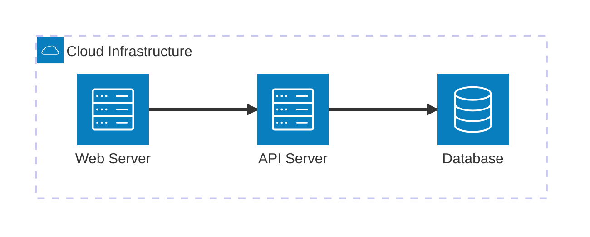

# Mermaid Visualizer

A comprehensive toolkit for rendering Mermaid diagrams, featuring both a Chrome extension and a desktop application. Built with modern web technologies and designed to support the latest Mermaid syntax including experimental beta features.

## Features

### Desktop Application
- **Live Editor**: Split-pane interface with syntax editor and real-time preview
- **Export Capabilities**: Export diagrams as SVG or high-quality PNG (2x DPI)
- **Template Library**: Pre-built examples for all diagram types
- **Beta Diagram Support**: Full support for experimental diagrams (architecture, block, treemap, kanban)
- **Keyboard Shortcuts**: Ctrl+Enter to render, Tab support in editor
- **Error Handling**: Clear, helpful error messages with syntax validation

### Chrome Extension (Planned)
- **Automatic Detection**: Scans web pages for Mermaid code blocks
- **Overlay Rendering**: Click-to-render buttons on code blocks
- **Dynamic Content**: MutationObserver for SPA support
- **Theme Support**: Multiple rendering themes
- **Offline Capable**: Bundled Mermaid library (no CDN dependency)

## Supported Diagram Types

### Stable Diagrams
- **Flowcharts** - Process flows and decision trees
- **Sequence Diagrams** - Actor interactions over time
- **Class Diagrams** - Object-oriented relationships
- **State Diagrams** - State machine transitions
- **Entity-Relationship Diagrams** - Database schemas
- **Gantt Charts** - Project timelines and schedules

### Beta/Experimental Diagrams ⚡
- **Architecture Diagrams** (`architecture-beta`) - Cloud and CI/CD architectures
- **Block Diagrams** (`block-beta`) - System components with precise layout
- **Treemap Diagrams** - Hierarchical data visualization
- **Kanban Boards** - Task management workflows
- **XY Charts** - Data plotting and visualization
- **Sankey Diagrams** - Flow and transfer visualization
- **Quadrant Charts** - Four-quadrant analysis

## Quick Start

### Desktop Application

1. **Open the application**:
   ```bash
   # Simply open in a browser
   open index_1.html
   ```

2. **Start creating diagrams**:
   - Type or paste Mermaid syntax in the left editor pane
   - Click "Render Diagram" or press Ctrl+Enter
   - Preview appears in the right pane
   - Use "Export SVG" or "Export PNG" to save

3. **Try beta diagrams**:
   - Select from the "Load Example" dropdown
   - Or paste any beta diagram syntax directly

### Example: Architecture Diagram



## Installation

### Prerequisites
- Node.js >= 20.0.0
- pnpm >= 8.0.0 (for monorepo development)
- Modern web browser (Chrome, Firefox, Edge, Safari)

### Development Setup

```bash
# Clone the repository
git clone <repository-url>
cd MermaidVisualizerNEw

# Install dependencies
pnpm install

# Build Mermaid from source (optional)
node build-mermaid.js v11.12.0

# Run tests
pnpm test

# Build all applications
pnpm run build:all
```

## Project Structure

```
MermaidVisualizerNEw/
├── index.html                 # Chrome extension demo/simulator
├── index_1.html              # Desktop application (standalone)
├── build-mermaid.js          # Script to build Mermaid from source
├── package.json              # Project dependencies and scripts
├── manifest.json             # Chrome extension manifest
├── tauri.conf.json          # Desktop app configuration (Tauri)
│
├── test-diagram-*.mmd       # Test diagrams for all types
├── tests/                   # Automated test suite
│   ├── diagram-validator.js # Diagram rendering tests
│   └── beta-features.test.js # Beta diagram tests
│
├── docs/                    # Documentation
│   ├── implementation-notes.md
│   ├── API.md
│   └── CONTRIBUTING.md
│
└── scripts/                 # Build and utility scripts
    └── chart_script.py      # Additional chart generation
```

## Testing

### Running Tests

```bash
# Run all tests
pnpm test

# Run diagram validation tests
pnpm test:diagrams

# Test specific diagram type
node tests/diagram-validator.js --type architecture-beta

# Validate all test diagrams render correctly
pnpm test:validate
```

### Test Coverage

The test suite includes:
- ✅ All stable diagram types (6 types)
- ✅ All beta diagram types (7+ types)
- ✅ Syntax validation
- ✅ Rendering verification
- ✅ Export functionality (SVG/PNG)
- ✅ Error handling

## Configuration

### Mermaid Version

The desktop application uses the latest Mermaid v11.x from CDN:

```javascript
// To pin to a specific version, edit index_1.html:
import('https://cdn.jsdelivr.net/npm/mermaid@11.12.0/dist/mermaid.esm.min.mjs')
```

### Mermaid Configuration

Default configuration in `index_1.html`:

```javascript
mermaid.initialize({
    startOnLoad: false,
    theme: 'default',
    securityLevel: 'loose'
});
```

## Building Mermaid from Source

The project includes a script to build Mermaid from source:

```bash
# Build latest release
node build-mermaid.js

# Build specific version
node build-mermaid.js v11.12.0

# Build from main branch (bleeding edge)
node build-mermaid.js main
```

Built files are placed in `packages/shared/vendor/`:
- `mermaid.esm.min.mjs` - ES module bundle
- `mermaid.d.ts` - TypeScript definitions
- `build-info.json` - Build metadata

## Browser Support

- Chrome/Edge >= 100
- Firefox >= 100
- Safari >= 13
- Opera >= 85

## Known Limitations

1. **Beta Diagram Syntax Changes**: Beta diagrams may have breaking syntax changes in future Mermaid versions
2. **CDN Dependency**: Desktop app requires internet connection for initial Mermaid load
3. **Export Quality**: PNG export quality depends on browser canvas implementation
4. **Large Diagrams**: Very large diagrams (>1000 nodes) may have performance issues

## Troubleshooting

### Diagrams Won't Render

1. Check syntax using [Mermaid Live Editor](https://mermaid.live/)
2. Verify you're using correct beta syntax (e.g., `architecture-beta` not `architecture`)
3. Open browser console to see detailed error messages
4. Ensure internet connection for CDN access

### Export Issues

- **SVG export fails**: Ensure diagram rendered successfully first
- **PNG has white background**: This is intentional for better compatibility
- **PNG quality poor**: Increase scale factor in `exportPNG()` function

### Beta Diagrams Not Working

1. Verify Mermaid version >= 11.1.0 (check status bar)
2. Use correct beta keyword syntax
3. Check [Mermaid documentation](https://mermaid.js.org/) for latest syntax
4. Try diagram in Mermaid Live Editor first

## Contributing

We welcome contributions! Please see [CONTRIBUTING.md](docs/CONTRIBUTING.md) for:
- Code style guidelines
- How to submit pull requests
- Development workflow
- Testing requirements

## Roadmap

- [ ] Chrome Extension implementation with TypeScript
- [ ] Tauri desktop app with native file system access
- [ ] Theme customization UI
- [ ] Diagram versioning and history
- [ ] Collaborative editing features
- [ ] Plugin system for custom diagram types
- [ ] Auto-save and recovery
- [ ] Diagram template marketplace

## Resources

- [Mermaid Documentation](https://mermaid.js.org/)
- [Architecture Diagrams Guide](https://mermaid.js.org/syntax/architecture)
- [Block Diagrams Guide](https://mermaid.js.org/syntax/block.html)
- [Mermaid Live Editor](https://mermaid.live/)
- [Iconify Icons](https://iconify.design/) (for architecture diagrams)

## License

MIT License - see LICENSE file for details

## Acknowledgments

- Built with [Mermaid.js](https://github.com/mermaid-js/mermaid)
- Inspired by the Mermaid community
- Icons from [Iconify](https://iconify.design/)

## Support

- 🐛 [Report Issues](https://github.com/your-repo/issues)
- 💬 [Discussions](https://github.com/your-repo/discussions)
- 📧 Email: support@example.com

---

**Current Version**: 1.0.0
**Mermaid Version**: 11.12.0+
**Last Updated**: 2025-01-10
