# Visually Rich Mermaid Examples

These examples demonstrate advanced styling capabilities that Mermaid.js supports.

## 1. Styled Flowchart - Project Workflow

```mermaid
%%{init: {'theme':'base', 'themeVariables': { 'primaryColor':'#ff6b6b','primaryTextColor':'#fff','primaryBorderColor':'#c92a2a','lineColor':'#495057','secondaryColor':'#4ecdc4','tertiaryColor':'#ffe66d','fontSize':'16px'}}}%%
graph TB
    Start([🚀 Start Project]) --> Planning[📋 Planning Phase]
    Planning --> Design[🎨 Design]
    Planning --> Research[🔬 Research]

    Design --> Review1{👥 Design Review}
    Research --> Review1

    Review1 -->|Approved ✅| Development[💻 Development]
    Review1 -->|Revisions Needed ⚠️| Planning

    Development --> Testing[🧪 Testing]
    Testing --> Review2{🔍 QA Review}

    Review2 -->|Pass ✅| Deploy[🚀 Deploy]
    Review2 -->|Fail ❌| Development

    Deploy --> Monitor[📊 Monitor]
    Monitor --> End([✨ Success!])

    style Start fill:#ff6b6b,stroke:#c92a2a,stroke-width:3px,color:#fff
    style End fill:#51cf66,stroke:#2f9e44,stroke-width:3px,color:#fff
    style Deploy fill:#4ecdc4,stroke:#22b8cf,stroke-width:3px
    style Testing fill:#ffe66d,stroke:#ffd43b
    style Development fill:#a78bfa,stroke:#7c3aed,color:#fff
```



## 2. Professional Sequence Diagram - E-commerce Checkout

```mermaid
%%{init: {'theme':'base', 'themeVariables': { 'primaryColor':'#667eea','secondaryColor':'#764ba2','tertiaryColor':'#f093fb','primaryTextColor':'#fff','lineColor':'#667eea','fontSize':'14px'}}}%%
sequenceDiagram
    autonumber
    actor Customer as 👤 Customer
    participant UI as 🖥️ Web App
    participant API as ⚙️ API Server
    participant Auth as 🔐 Auth Service
    participant Payment as 💳 Payment Gateway
    participant DB as 🗄️ Database

    Customer->>+UI: Add items to cart
    UI->>+API: GET /cart
    API->>+DB: Fetch cart data
    DB-->>-API: Cart items
    API-->>-UI: Cart contents

    Customer->>+UI: Proceed to checkout
    UI->>+Auth: Verify session
    Auth-->>-UI: Session valid ✅

    UI->>+Customer: Request payment info
    Customer->>-UI: Enter card details

    UI->>+API: POST /checkout
    API->>+Payment: Process payment

    alt Payment Successful
        Payment-->>API: Success ✅
        API->>DB: Create order
        DB-->>API: Order created
        API-->>UI: Order confirmed
        UI-->>Customer: Thank you! 🎉
    else Payment Failed
        Payment-->>API: Failed ❌
        API-->>UI: Payment error
        UI-->>Customer: Please retry
    end

    deactivate API
```



## 3. Modern Class Diagram - Microservices Architecture


## 4. Colorful State Diagram - Order Processing

```mermaid
%%{init: {'theme':'base', 'themeVariables': { 'primaryColor':'#14b8a6','secondaryColor':'#8b5cf6','tertiaryColor':'#f59e0b','noteBkgColor':'#fef3c7','noteBorderColor':'#f59e0b','fontSize':'14px'}}}%%
stateDiagram-v2
    [*] --> Pending : Order Created 📝

    Pending --> Processing : Payment Received 💰
    Pending --> Cancelled : Customer Cancelled ❌

    Processing --> Shipped : Items Packed 📦
    Processing --> OnHold : Issue Detected ⚠️
    Processing --> Cancelled : Payment Failed ❌

    OnHold --> Processing : Issue Resolved ✅
    OnHold --> Cancelled : Cannot Resolve ❌

    Shipped --> InTransit : Picked Up 🚚
    InTransit --> Delivered : Delivered ✅
    InTransit --> ReturnInitiated : Return Requested 🔄

    Delivered --> Completed : 30 Days Passed ✨
    Delivered --> ReturnInitiated : Customer Returns 🔄

    ReturnInitiated --> Returned : Item Received Back
    Returned --> Refunded : Money Returned 💵

    Completed --> [*]
    Refunded --> [*]
    Cancelled --> [*]

    note right of Pending
        New orders wait here
        for payment confirmation
    end note

    note right of Delivered
        Success! Order complete.
        Money held for 30 days.
    end note
```



## 5. Advanced Architecture Diagram - Cloud Infrastructure


## 6. Styled Gantt Chart - Product Launch Timeline


## 7. Vibrant XY Chart - Sales Performance

```mermaid
xychart-beta
    title "📈 Quarterly Sales Performance (in thousands)"
    x-axis [Jan, Feb, Mar, Apr, May, Jun, Jul, Aug, Sep, Oct, Nov, Dec]
    y-axis "Revenue ($K)" 0 --> 150
    bar [45, 52, 48, 75, 82, 78, 92, 98, 105, 112, 125, 142]
    line [40, 50, 55, 70, 80, 85, 90, 95, 100, 110, 120, 140]
```



## 8. Complex Sankey Diagram - User Journey


## Usage Notes

All these examples can be customized further by:

1. **Changing Colors**: Modify `primaryColor`, `secondaryColor`, `tertiaryColor`
2. **Adjusting Fonts**: Change `fontSize` in themeVariables
3. **Applying Themes**: Use 'default', 'dark', 'forest', 'neutral', or 'base'
4. **Adding Styles**: Use inline style commands for specific elements
5. **Using Emojis**: Add visual interest with Unicode emojis

## Color Palette Examples

**Professional Blue**:
```
primaryColor: '#3b82f6'
secondaryColor: '#1e40af'
tertiaryColor: '#93c5fd'
```

**Modern Purple**:
```
primaryColor: '#8b5cf6'
secondaryColor: '#7c3aed'
tertiaryColor: '#c4b5fd'
```

**Vibrant Gradient**:
```
primaryColor: '#ec4899'
secondaryColor: '#f43f5e'
tertiaryColor: '#fda4af'
```
