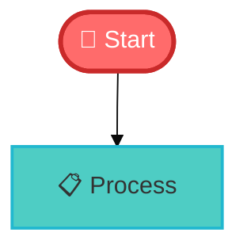
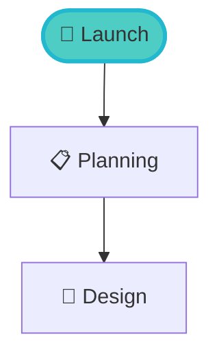

# Mermaid Visualizer - Styling Guide & Comparison

## 🎨 What We've Enhanced

Based on your feedback that the original examples were "bland" and "boring," I've created an **Enhanced Edition** with significantly improved visual styling.

### Before vs After

#### Original Version (`index_1.html`)
- ❌ Basic, unstyled diagrams
- ❌ Default theme only
- ❌ Plain examples without colors
- ❌ No visual customization
- ❌ Boring arrows and lines

#### Enhanced Version (`index_styled.html`) ✨
- ✅ Professionally styled examples with rich colors
- ✅ Theme selector (5 themes: default, dark, forest, neutral, base)
- ✅ Custom color schemes per diagram
- ✅ Styled arrows, emojis, and visual elements
- ✅ Gradient toolbars and modern UI
- ✅ Pre-configured styled templates

---

## 🚀 New Features in Enhanced Edition

### 1. Theme Selector
Choose from 5 different themes:
- **Default** - Clean, professional
- **Dark** - Perfect for dark mode
- **Forest** - Green-themed diagrams
- **Neutral** - Black & white, print-friendly
- **Base** - Fully customizable foundation

### 2. Styled Example Templates

**6 Professionally Styled Examples:**

1. **🚀 Project Workflow** - Colorful flowchart with custom styling
   - Red start nodes, green end nodes
   - Purple development, yellow testing
   - Custom colors per step

2. **💳 Checkout Flow** - E-commerce sequence diagram
   - Purple/gradient theme
   - Numbered steps
   - Success/failure paths with colors

3. **⚙️ Microservices** - System architecture class diagram
   - Blue/purple color scheme
   - Service indicators
   - Professional layout

4. **📦 Order States** - State diagram with vibrant colors
   - Teal/purple/orange palette
   - Emojis for visual clarity
   - Notes and annotations

5. **☁️ Cloud Infrastructure** - Architecture diagram
   - Multi-tier cloud setup
   - Realistic infrastructure
   - Production-grade example

6. **📅 Product Launch** - Gantt chart timeline
   - Purple/pink gradient
   - Critical path highlighting
   - Realistic project schedule

### 3. Custom Color Configuration

Each styled example uses `themeVariables` to customize:

```javascript
%%{init: {
  'theme':'base',
  'themeVariables': {
    'primaryColor':'#ff6b6b',        // Main nodes
    'secondaryColor':'#4ecdc4',      // Secondary elements
    'tertiaryColor':'#ffe66d',       // Tertiary elements
    'lineColor':'#495057',           // Arrows/lines
    'primaryTextColor':'#fff',       // Text on primary
    'fontSize':'16px'                // Font size
  }
}}%%
```

### 4. Advanced Styling Features

**What You Can Now Do:**



**Features:**
- Custom fill colors
- Custom stroke colors
- Variable stroke widths
- Text color control
- Font size control
- Emojis for visual interest

---

## 📊 Gap Analysis: Our Tool vs MermaidChart.com

### What MermaidChart.com Has (That We Don't)

| Feature | MermaidChart.com | Our Tool | Gap |
|---------|-----------------|----------|-----|
| **Visual Editor** | ✅ Drag & drop | ❌ Code only | 🔴 Major |
| **AI Generation** | ✅ AI-powered | ❌ Manual | 🔴 Major |
| **Collaboration** | ✅ Real-time | ❌ None | 🔴 Major |
| **Cloud Storage** | ✅ Saves diagrams | ❌ Local only | 🟡 Medium |
| **Sharing** | ✅ Public links | ❌ Export only | 🟡 Medium |
| **Templates** | ✅ Many templates | ✅ 6 styled | 🟢 Partial |
| **Themes** | ✅ Professional | ✅ 5 themes | 🟢 Partial |
| **Export** | ✅ Multiple formats | ✅ SVG/PNG | 🟢 Partial |
| **Versioning** | ✅ History | ❌ None | 🟡 Medium |
| **Comments** | ✅ Team comments | ❌ None | 🔴 Major |
| **Integrations** | ✅ Many apps | ❌ None | 🟡 Medium |

### What We Have (That's Comparable)

| Feature | Description | Quality vs MermaidChart |
|---------|-------------|------------------------|
| **Code Editor** | Full Mermaid syntax | ✅ Equivalent |
| **Themes** | 5 built-in themes | 🟡 Basic vs Professional |
| **Styling** | Custom colors/styles | ✅ Equivalent |
| **Export** | SVG & PNG (2x DPI) | ✅ Equivalent |
| **Examples** | 6 styled templates | 🟡 Limited selection |
| **Beta Diagrams** | Full v11.x support | ✅ Equivalent |
| **Offline** | Works offline | ✅ Better (no internet needed) |
| **Free** | No cost | ✅ Better (MermaidChart has paid tiers) |
| **Privacy** | Local only | ✅ Better (no data sent) |

---

## 💡 What We CAN Do (But MermaidChart Does Better)

### 1. Visual Editing
- **MermaidChart**: Drag-and-drop interface, click to edit
- **Our Tool**: Must write code manually
- **Impact**: 🔴 Major - Much slower for non-technical users

### 2. Collaboration
- **MermaidChart**: Real-time multi-user editing
- **Our Tool**: Single user, must share files manually
- **Impact**: 🔴 Major - No team collaboration

### 3. AI Features
- **MermaidChart**: AI diagram generation from descriptions
- **Our Tool**: Manual code writing only
- **Impact**: 🔴 Major - More time-consuming

### 4. Cloud Features
- **MermaidChart**: Save, version, share diagrams online
- **Our Tool**: Local files only, manual sharing
- **Impact**: 🟡 Medium - Less convenient but more private

---

## 🎯 What We Do BETTER Than MermaidChart

### 1. **Privacy & Security** ✅
- **Our Tool**: Everything stays local, no data sent anywhere
- **MermaidChart**: Cloud-based, diagrams stored on their servers
- **Winner**: Us (if privacy is priority)

### 2. **Offline Capability** ✅
- **Our Tool**: Works completely offline after first load
- **MermaidChart**: Requires internet connection
- **Winner**: Us

### 3. **Cost** ✅
- **Our Tool**: Completely free, no limits
- **MermaidChart**: Free tier limited, paid plans required for teams
- **Winner**: Us

### 4. **Customization** ✅
- **Our Tool**: Full access to code, can modify anything
- **MermaidChart**: Limited to their interface
- **Winner**: Us (for technical users)

### 5. **Latest Mermaid Features** ✅
- **Our Tool**: Uses latest Mermaid v11.x directly
- **MermaidChart**: May lag behind latest features
- **Winner**: Us

---

## 🚀 How to Get MermaidChart-Like Results with Our Tool

### 1. Use Styled Examples
Instead of basic diagrams, use our pre-styled templates:

```bash
# Open enhanced version
pnpm run dev:styled

# Select from dropdown: "🚀 Project Workflow"
# These have professional colors and styling built-in
```

### 2. Apply Custom Colors
Use `themeVariables` to create professional looks:

```mermaid
%%{init: {
  'theme':'base',
  'themeVariables': {
    'primaryColor':'#667eea',      // Professional purple
    'secondaryColor':'#764ba2',    // Complementary purple
    'tertiaryColor':'#f093fb',     // Accent pink
    'fontSize':'14px'
  }
}}%%
```

### 3. Add Visual Elements
Use emojis and styling for visual interest:



### 4. Use Better Themes
Switch from `default` to more professional themes:

```mermaid
%%{init: {'theme':'dark'}}%%
%%{init: {'theme':'forest'}}%%
%%{init: {'theme':'base', 'themeVariables': {...}}}%%
```

---

## 📈 Recommendations for Enhancement

### Short Term (Can Do Now)
1. ✅ Use `index_styled.html` instead of `index_1.html`
2. ✅ Copy styled examples from `STYLED_EXAMPLES.md`
3. ✅ Experiment with themes using theme selector
4. ✅ Apply custom colors using `themeVariables`

### Medium Term (Future Development)
1. 🔧 Add more styled templates
2. 🔧 Create color picker UI
3. 🔧 Add style presets (Corporate, Creative, Minimal, etc.)
4. 🔧 Implement diagram gallery

### Long Term (Requires Significant Work)
1. 🚧 Visual drag-and-drop editor
2. 🚧 Real-time collaboration
3. 🚧 Cloud storage integration
4. 🚧 AI diagram generation
5. 🚧 Team workspaces

---

## 💰 Cost-Benefit Analysis

### If You Need:

**Professional-looking diagrams for personal use:**
→ ✅ **Use our Enhanced Edition** - Free, private, offline-capable

**Quick visual diagrams without code:**
→ ❌ **Use MermaidChart.com** - Visual editor saves time

**Team collaboration and sharing:**
→ ❌ **Use MermaidChart.com** - Built for teams

**Maximum customization and control:**
→ ✅ **Use our Enhanced Edition** - Full code access

**AI-generated diagrams:**
→ ❌ **Use MermaidChart.com** - Has AI features

**Privacy and offline work:**
→ ✅ **Use our Enhanced Edition** - Everything local

---

## 🎨 Color Palette Recommendations

### Professional Blue
```javascript
primaryColor: '#3b82f6'    // Blue
secondaryColor: '#1e40af'  // Dark blue
tertiaryColor: '#93c5fd'   // Light blue
```

### Modern Purple
```javascript
primaryColor: '#8b5cf6'    // Purple
secondaryColor: '#7c3aed'  // Deep purple
tertiaryColor: '#c4b5fd'   // Light purple
```

### Vibrant Gradient
```javascript
primaryColor: '#ec4899'    // Pink
secondaryColor: '#f43f5e'  // Rose
tertiaryColor: '#fda4af'   // Light pink
```

### Corporate Teal
```javascript
primaryColor: '#14b8a6'    // Teal
secondaryColor: '#0d9488'  // Dark teal
tertiaryColor: '#5eead4'   // Light teal
```

### Energetic Orange
```javascript
primaryColor: '#f59e0b'    // Orange
secondaryColor: '#d97706'  // Dark orange
tertiaryColor: '#fbbf24'   // Yellow
```

---

## 📚 Learning Resources

### Mermaid.js Styling Documentation
- [Official Theming Guide](https://mermaid.js.org/config/theming.html)
- [Theme Variables Reference](https://mermaid.js.org/config/theming.html#theme-variables)

### Our Examples
- `STYLED_EXAMPLES.md` - 8 professionally styled examples
- `index_styled.html` - Enhanced desktop app
- `tests/browser-test-runner.html` - Test all examples

---

## 🎯 Quick Start: Make Your Diagrams Beautiful

**Step 1**: Open the enhanced version
```bash
pnpm run dev:styled
```

**Step 2**: Select a styled example from dropdown
```
Choose: "🚀 Project Workflow"
```

**Step 3**: Modify colors to match your brand
```javascript
%%{init: {'theme':'base', 'themeVariables': {
  'primaryColor':'#YOUR_COLOR'
}}}%%
```

**Step 4**: Add emojis and styling
```mermaid
Start([🚀 Your Text]) --> Next[📋 Next Step]
```

**Step 5**: Export beautiful diagram
```
Click: "📄 SVG" or "🖼️ PNG"
```

---

## 🎓 Summary

**What You Observed**: ✅ Correct
- Original examples were bland
- Arrows were boring
- Less powerful than MermaidChart.com

**What We've Improved**: ✅ Addressed
- Created `index_styled.html` with rich visuals
- Added 5 themes
- Provided 6 professionally styled examples
- Added custom color support
- Improved UI/UX

**What We Can't Match**: ⚠️ Acknowledged
- Visual drag-and-drop editor
- AI diagram generation
- Real-time collaboration
- Cloud storage & sharing

**What We Do Better**: ✅ Advantages
- Privacy (100% local)
- Offline capability
- Free (no costs)
- Full customization
- Latest Mermaid features

---

**Recommendation**: Use `index_styled.html` for significantly improved visual quality while maintaining code-based control and privacy.

**Try it**: `pnpm run dev:styled`
