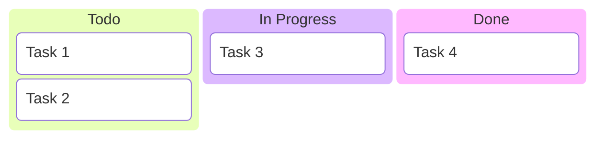

# Contributing to Mermaid Visualizer

Thank you for your interest in contributing to Mermaid Visualizer! This document provides guidelines and instructions for contributing to the project.

## Table of Contents

- [Code of Conduct](#code-of-conduct)
- [Getting Started](#getting-started)
- [Development Workflow](#development-workflow)
- [Coding Standards](#coding-standards)
- [Testing Guidelines](#testing-guidelines)
- [Pull Request Process](#pull-request-process)
- [Reporting Bugs](#reporting-bugs)
- [Suggesting Enhancements](#suggesting-enhancements)

## Code of Conduct

This project adheres to a Code of Conduct that all contributors are expected to follow. By participating, you are expected to uphold this code. Please report unacceptable behavior to the project maintainers.

### Our Standards

- Be respectful and inclusive
- Welcome newcomers and help them learn
- Focus on what is best for the community
- Show empathy towards other community members
- Accept constructive criticism gracefully

## Getting Started

### Prerequisites

- Node.js >= 20.0.0
- pnpm >= 8.0.0
- Git
- A modern code editor (VS Code recommended)

### Setting Up Your Development Environment

1. **Fork the repository** on GitHub

2. **Clone your fork**:
   ```bash
   git clone https://github.com/YOUR_USERNAME/MermaidVisualizerNEw.git
   cd MermaidVisualizerNEw
   ```

3. **Add upstream remote**:
   ```bash
   git remote add upstream https://github.com/ORIGINAL_OWNER/MermaidVisualizerNEw.git
   ```

4. **Install dependencies**:
   ```bash
   pnpm install
   ```

5. **Verify setup**:
   ```bash
   pnpm test
   ```

## Development Workflow

### Branch Strategy

- `master` - Production-ready code
- `develop` - Integration branch for features
- `feature/*` - New features
- `bugfix/*` - Bug fixes
- `hotfix/*` - Urgent production fixes

### Creating a Feature Branch

```bash
# Update your local master
git checkout master
git pull upstream master

# Create a feature branch
git checkout -b feature/your-feature-name
```

### Making Changes

1. **Make your changes** in logical, atomic commits
2. **Write clear commit messages** following conventional commits:
   ```
   feat: add architecture diagram support
   fix: resolve PNG export issue on Safari
   docs: update README with beta diagram examples
   test: add tests for treemap diagrams
   refactor: simplify diagram renderer logic
   ```

3. **Keep commits focused**: One logical change per commit
4. **Test your changes**: Ensure all tests pass
5. **Update documentation**: If you change functionality

### Conventional Commit Types

- `feat`: New feature
- `fix`: Bug fix
- `docs`: Documentation changes
- `style`: Code style changes (formatting, semicolons, etc.)
- `refactor`: Code refactoring
- `test`: Adding or updating tests
- `chore`: Maintenance tasks
- `perf`: Performance improvements

## Coding Standards

### JavaScript/HTML/CSS

1. **Use modern ES6+ syntax**
2. **Follow consistent indentation** (4 spaces)
3. **Use meaningful variable names**:
   ```javascript
   // Good
   const diagramRenderer = new DiagramRenderer();

   // Bad
   const dr = new DiagramRenderer();
   ```

4. **Add comments for complex logic**:
   ```javascript
   // Convert SVG to PNG with 2x scale for HiDPI displays
   const scale = 2;
   canvas.width = svgWidth * scale;
   ```

5. **Use JSDoc for functions**:
   ```javascript
   /**
    * Renders a Mermaid diagram from source code
    * @param {string} code - Mermaid diagram syntax
    * @returns {Promise<string>} Rendered SVG string
    * @throws {Error} If diagram syntax is invalid
    */
   async function renderDiagram(code) {
       // ...
   }
   ```

### File Organization

```
project/
├── src/           # Source code
├── tests/         # Test files
├── docs/          # Documentation
└── scripts/       # Build scripts
```

### Code Style

- **Line length**: Max 100 characters
- **Quotes**: Single quotes for strings (except JSON)
- **Semicolons**: Required
- **Trailing commas**: Use in multiline objects/arrays
- **Arrow functions**: Prefer over function expressions

Example:
```javascript
const examples = {
    flowchart: 'graph TD...',
    sequence: 'sequenceDiagram...',
    // More examples...
};

const renderButton = document.querySelector('#renderBtn');
renderButton.addEventListener('click', async () => {
    await renderDiagram();
});
```

## Testing Guidelines

### Test Structure

Place tests in the `tests/` directory with descriptive names:
```
tests/
├── diagram-validator.js
├── beta-features.test.js
├── export-functionality.test.js
└── error-handling.test.js
```

### Writing Tests

1. **Test file naming**: `feature-name.test.js`
2. **Test descriptions**: Clear and specific
3. **Use AAA pattern**: Arrange, Act, Assert

Example test:
```javascript
/**
 * Test: Architecture diagram rendering
 */
async function testArchitectureDiagram() {
    // Arrange
    const code = `architecture-beta
        service web(server)[Web Server]
        service db(database)[Database]
        web:R --> L:db`;

    // Act
    const result = await renderDiagram(code);

    // Assert
    if (!result.includes('<svg')) {
        throw new Error('Architecture diagram failed to render');
    }

    console.log('✅ Architecture diagram test passed');
}
```

### Test Coverage Requirements

- All new features must include tests
- Bug fixes must include regression tests
- Maintain >80% code coverage
- Test both success and error cases

### Running Tests

```bash
# Run all tests
pnpm test

# Run specific test file
node tests/diagram-validator.js

# Run with verbose output
pnpm test -- --verbose
```

## Pull Request Process

### Before Submitting

1. ✅ All tests pass locally
2. ✅ Code follows style guidelines
3. ✅ Documentation is updated
4. ✅ Commit messages follow conventions
5. ✅ Branch is up to date with master

### Submitting a Pull Request

1. **Push your branch**:
   ```bash
   git push origin feature/your-feature-name
   ```

2. **Create PR on GitHub** with:
   - **Clear title**: Following conventional commit format
   - **Description**: What changes and why
   - **Related issues**: Reference issue numbers
   - **Screenshots**: For UI changes
   - **Testing**: How you tested the changes

3. **PR Template**:
   ```markdown
   ## Description
   Brief description of changes

   ## Type of Change
   - [ ] Bug fix
   - [ ] New feature
   - [ ] Breaking change
   - [ ] Documentation update

   ## Testing
   - [ ] All tests pass
   - [ ] Added new tests
   - [ ] Manual testing completed

   ## Checklist
   - [ ] Code follows style guidelines
   - [ ] Self-review completed
   - [ ] Documentation updated
   - [ ] No new warnings

   ## Screenshots (if applicable)

   ## Related Issues
   Closes #123
   ```

### Review Process

1. **Automated checks** run (tests, linting)
2. **Code review** by maintainers
3. **Changes requested** (if needed)
4. **Approval** and merge

### After Merge

1. **Delete your feature branch**:
   ```bash
   git branch -d feature/your-feature-name
   git push origin --delete feature/your-feature-name
   ```

2. **Update your local master**:
   ```bash
   git checkout master
   git pull upstream master
   ```

## Reporting Bugs

### Before Submitting a Bug Report

1. **Check existing issues** for duplicates
2. **Verify it's reproducible** in the latest version
3. **Gather information**:
   - Browser version
   - Operating system
   - Mermaid version
   - Steps to reproduce
   - Expected vs actual behavior

### Bug Report Template

```markdown
## Bug Description
Clear description of the bug

## Steps to Reproduce
1. Go to '...'
2. Click on '...'
3. Enter '...'
4. See error

## Expected Behavior
What should happen

## Actual Behavior
What actually happens

## Screenshots
If applicable

## Environment
- OS: [e.g., Windows 11]
- Browser: [e.g., Chrome 120]
- Mermaid Version: [e.g., 11.12.0]
- Application Version: [e.g., 1.0.0]

## Additional Context
Any other relevant information
```

## Suggesting Enhancements

### Enhancement Proposal Template

```markdown
## Feature Description
Clear description of the proposed feature

## Problem Statement
What problem does this solve?

## Proposed Solution
How would this work?

## Alternatives Considered
Other approaches you considered

## Benefits
- Benefit 1
- Benefit 2

## Potential Drawbacks
- Drawback 1
- Drawback 2

## Implementation Notes
Technical considerations
```

## Adding New Diagram Types

When adding support for new Mermaid diagram types:

1. **Create test diagram** in `test-diagram-{type}.mmd`
2. **Add example** to desktop app dropdown
3. **Write validation test** in `tests/`
4. **Update documentation** in README.md
5. **Test thoroughly** across browsers

Example test diagram (`test-diagram-kanban.mmd`):


## Documentation Standards

### README Updates

- Keep README.md concise and user-focused
- Use clear headings and sections
- Include code examples
- Add screenshots for visual features
- Update table of contents

### Code Documentation

- Use JSDoc for all public functions
- Explain complex algorithms
- Document edge cases
- Include usage examples

### API Documentation

- Document all public APIs
- Include parameter types
- Show example requests/responses
- Note any breaking changes

## Style Guide

### Naming Conventions

- **Variables**: camelCase (`diagramType`, `renderButton`)
- **Constants**: UPPER_CASE (`MAX_RETRIES`, `DEFAULT_THEME`)
- **Functions**: camelCase (`renderDiagram`, `exportPNG`)
- **Classes**: PascalCase (`DiagramRenderer`, `ExportManager`)
- **Files**: kebab-case (`diagram-validator.js`, `test-diagram-architecture.mmd`)

### Error Handling

Always handle errors gracefully:

```javascript
try {
    const result = await renderDiagram(code);
    showSuccess('Diagram rendered successfully');
} catch (error) {
    showError(`Failed to render: ${error.message}`);
    console.error('Render error:', error);
}
```

## Release Process

Releases follow semantic versioning (MAJOR.MINOR.PATCH):

- **MAJOR**: Breaking changes
- **MINOR**: New features (backward compatible)
- **PATCH**: Bug fixes

## Questions?

- 💬 Start a [Discussion](https://github.com/your-repo/discussions)
- 📧 Email maintainers
- 💡 Check existing issues and PRs

## Recognition

Contributors are recognized in:
- CONTRIBUTORS.md file
- Release notes
- Project README

Thank you for contributing to Mermaid Visualizer! 🎉
