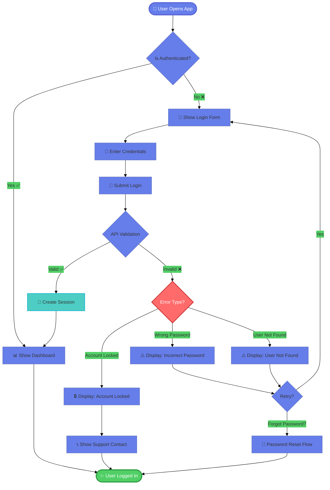
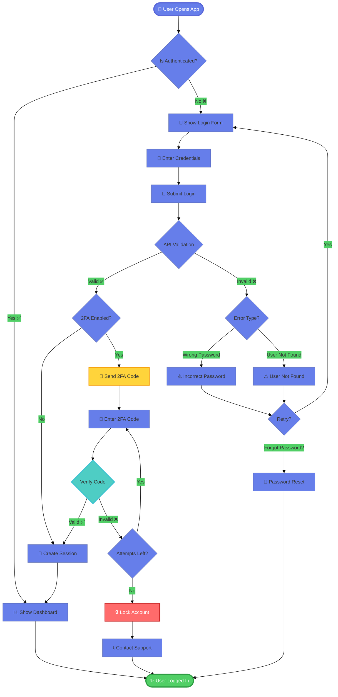

# Future Architecture: AI Diagram Generation

## Overview

This document outlines the architecture for integrating AI-powered diagram generation into the Mermaid Visualizer, enabling users to describe diagrams in natural language and have them automatically generated.

---

## Goals

1. **Natural Language Input**: Users describe what they want in plain English
2. **Automatic Code Generation**: AI generates valid Mermaid syntax
3. **Iterative Refinement**: Users can refine diagrams through conversation
4. **Context Awareness**: AI understands diagram types and best practices
5. **Styling Integration**: AI applies appropriate themes and styling

---

## Architecture Components

### 1. AI Integration Layer

```
┌─────────────────────────────────────────────────────────┐
│                    User Interface                       │
├─────────────────────────────────────────────────────────┤
│  Text Input: "Create a flowchart for user login"       │
│  [Generate Diagram] [Refine] [Apply Theme]             │
└─────────────────────────────────────────────────────────┘
                           ↓
┌─────────────────────────────────────────────────────────┐
│               AI Service Abstraction                    │
├─────────────────────────────────────────────────────────┤
│  • OpenAI GPT-4/Claude API                             │
│  • Anthropic Claude API (primary)                      │
│  • Google Gemini API (via MCP)                         │
│  • Local LLM fallback (ollama)                         │
└─────────────────────────────────────────────────────────┘
                           ↓
┌─────────────────────────────────────────────────────────┐
│              Prompt Engineering Layer                   │
├─────────────────────────────────────────────────────────┤
│  • Diagram type detection                              │
│  • Context injection (examples, syntax rules)          │
│  • Styling preferences                                 │
│  • Validation requirements                             │
└─────────────────────────────────────────────────────────┘
                           ↓
┌─────────────────────────────────────────────────────────┐
│             Mermaid Code Generator                      │
├─────────────────────────────────────────────────────────┤
│  • Syntax validation                                   │
│  • Auto-correction                                     │
│  • Style application                                   │
│  • Preview generation                                  │
└─────────────────────────────────────────────────────────┘
```

---

## Implementation Approach

### Phase 1: Basic AI Generation (MVP)

**Timeline**: 1-2 weeks

**Components**:
1. Simple text input field
2. API integration (Anthropic Claude preferred)
3. Basic prompt templates
4. Mermaid code output

**Example Flow**:
```javascript
// User input
const userPrompt = "Create a flowchart for user login process";

// AI prompt construction
const systemPrompt = `You are a Mermaid diagram expert. Generate valid Mermaid syntax.
User request: ${userPrompt}
Return ONLY valid Mermaid code, no explanations.`;

// API call
const response = await callAI(systemPrompt);

// Render in editor
editor.setValue(response.code);
```

### Phase 2: Context-Aware Generation

**Timeline**: 2-3 weeks

**Enhancements**:
1. Diagram type auto-detection
2. Style preference injection
3. Multi-turn conversation
4. Example-based learning

**Prompt Template**:
```javascript
const promptTemplate = `
You are a Mermaid diagram expert specializing in ${diagramType}.

User request: "${userInput}"

Requirements:
- Use Mermaid ${version} syntax
- Apply ${theme} theme
- Include styling with these colors: ${colors}
- Follow best practices for ${diagramType}

Examples of good ${diagramType} diagrams:
${examples}

Generate ONLY valid Mermaid code. Use themeVariables for styling.
`;
```

### Phase 3: Advanced Features

**Timeline**: 1-2 months

**Features**:
1. Iterative refinement ("Make it more colorful", "Add error handling")
2. Diagram-to-text (explain existing diagrams)
3. Auto-suggestions during typing
4. Template library integration
5. Smart defaults based on content

---

## API Integration Options

### Option 1: Anthropic Claude (Recommended)

**Pros**:
- Excellent at structured output
- Large context window (200K tokens)
- Good at following instructions
- Already familiar via MCP

**Implementation**:
```javascript
class ClaudeAIService {
    constructor(apiKey) {
        this.apiKey = apiKey;
        this.endpoint = 'https://api.anthropic.com/v1/messages';
    }

    async generateDiagram(userPrompt, options = {}) {
        const systemPrompt = this.buildSystemPrompt(options);

        const response = await fetch(this.endpoint, {
            method: 'POST',
            headers: {
                'x-api-key': this.apiKey,
                'anthropic-version': '2023-06-01',
                'content-type': 'application/json'
            },
            body: JSON.stringify({
                model: 'claude-3-5-sonnet-20241022',
                max_tokens: 4096,
                system: systemPrompt,
                messages: [{
                    role: 'user',
                    content: userPrompt
                }]
            })
        });

        const data = await response.json();
        return this.extractMermaidCode(data.content[0].text);
    }

    buildSystemPrompt(options) {
        return `You are a Mermaid diagram expert.

Diagram type: ${options.type || 'auto-detect'}
Theme: ${options.theme || 'default'}
Style preferences: ${JSON.stringify(options.style || {})}

Generate valid Mermaid syntax based on the user's request.
Include appropriate styling using themeVariables.
Use emojis for visual interest where appropriate.
Return ONLY the Mermaid code, no markdown code blocks.`;
    }

    extractMermaidCode(text) {
        // Remove markdown code blocks if present
        const codeBlockMatch = text.match(/```(?:mermaid)?\n([\s\S]*?)\n```/);
        if (codeBlockMatch) {
            return codeBlockMatch[1].trim();
        }
        return text.trim();
    }
}
```

### Option 2: OpenAI GPT-4

**Pros**:
- Widely available
- Good performance
- Large community

**Implementation**:
```javascript
class OpenAIService {
    constructor(apiKey) {
        this.apiKey = apiKey;
        this.endpoint = 'https://api.openai.com/v1/chat/completions';
    }

    async generateDiagram(userPrompt, options = {}) {
        const response = await fetch(this.endpoint, {
            method: 'POST',
            headers: {
                'Authorization': `Bearer ${this.apiKey}`,
                'Content-Type': 'application/json'
            },
            body: JSON.stringify({
                model: 'gpt-4-turbo-preview',
                messages: [
                    {
                        role: 'system',
                        content: this.buildSystemPrompt(options)
                    },
                    {
                        role: 'user',
                        content: userPrompt
                    }
                ],
                temperature: 0.3
            })
        });

        const data = await response.json();
        return this.extractMermaidCode(data.choices[0].message.content);
    }
}
```

### Option 3: Google Gemini via MCP

**Pros**:
- Free tier available
- Already integrated via MCP
- Large context window

**Implementation**:
```javascript
class GeminiMCPService {
    async generateDiagram(userPrompt, options = {}) {
        // Use existing MCP integration
        const prompt = `${this.buildSystemPrompt(options)}

User request: ${userPrompt}`;

        const response = await window.mcp.tools['ask-gemini']({
            prompt: prompt,
            model: 'gemini-2.0-flash-exp'
        });

        return this.extractMermaidCode(response.result);
    }
}
```

### Option 4: Local LLM (Ollama)

**Pros**:
- Completely private
- No API costs
- Offline capability

**Implementation**:
```javascript
class OllamaService {
    constructor(baseUrl = 'http://localhost:11434') {
        this.baseUrl = baseUrl;
    }

    async generateDiagram(userPrompt, options = {}) {
        const response = await fetch(`${this.baseUrl}/api/generate`, {
            method: 'POST',
            headers: {
                'Content-Type': 'application/json'
            },
            body: JSON.stringify({
                model: 'llama3.1',
                prompt: `${this.buildSystemPrompt(options)}\n\n${userPrompt}`,
                stream: false
            })
        });

        const data = await response.json();
        return this.extractMermaidCode(data.response);
    }
}
```

---

## UI/UX Design

### AI Generation Panel

```html
<div class="ai-panel">
    <div class="ai-header">
        <h3>🤖 AI Diagram Generator</h3>
        <select id="aiProvider">
            <option value="claude">Claude (Recommended)</option>
            <option value="openai">OpenAI GPT-4</option>
            <option value="gemini">Google Gemini</option>
            <option value="ollama">Local (Ollama)</option>
        </select>
    </div>

    <div class="ai-input">
        <textarea id="aiPrompt"
                  placeholder="Describe your diagram in natural language...

Example: Create a flowchart showing how a user logs into a system, including error handling and password reset flow"></textarea>

        <div class="ai-options">
            <select id="aiDiagramType">
                <option value="auto">Auto-detect type</option>
                <option value="flowchart">Flowchart</option>
                <option value="sequence">Sequence Diagram</option>
                <option value="class">Class Diagram</option>
                <option value="state">State Diagram</option>
                <option value="architecture">Architecture</option>
            </select>

            <select id="aiTheme">
                <option value="default">Default Theme</option>
                <option value="dark">Dark Theme</option>
                <option value="styled">Styled (Colorful)</option>
            </select>

            <label>
                <input type="checkbox" id="aiUseEmojis" checked>
                Use emojis
            </label>
        </div>

        <div class="ai-actions">
            <button id="generateBtn" class="btn btn-primary">
                ✨ Generate Diagram
            </button>
            <button id="refineBtn" class="btn btn-secondary" disabled>
                🔄 Refine
            </button>
        </div>
    </div>

    <div class="ai-status" id="aiStatus">
        Ready to generate diagrams
    </div>
</div>
```

### Conversation History

```javascript
class AIConversation {
    constructor() {
        this.history = [];
    }

    async generate(userPrompt, context = {}) {
        this.history.push({
            role: 'user',
            content: userPrompt,
            timestamp: Date.now()
        });

        const response = await this.aiService.generateDiagram(
            userPrompt,
            { ...context, history: this.history }
        );

        this.history.push({
            role: 'assistant',
            content: response,
            timestamp: Date.now()
        });

        return response;
    }

    async refine(refinementPrompt) {
        const lastDiagram = this.getLastDiagram();
        const fullPrompt = `Current diagram:
\`\`\`mermaid
${lastDiagram}
\`\`\`

Refinement request: ${refinementPrompt}

Generate the updated Mermaid code.`;

        return this.generate(fullPrompt);
    }

    getLastDiagram() {
        for (let i = this.history.length - 1; i >= 0; i--) {
            if (this.history[i].role === 'assistant') {
                return this.history[i].content;
            }
        }
        return null;
    }
}
```

---

## Prompt Engineering

### Base System Prompt

```
You are an expert Mermaid diagram generator. Your role is to convert natural language descriptions into valid, well-structured Mermaid diagram syntax.

Guidelines:
1. Generate ONLY valid Mermaid syntax
2. Use appropriate diagram types based on user intent
3. Apply professional styling using themeVariables
4. Include emojis for visual clarity (when appropriate)
5. Follow Mermaid v11.x syntax
6. Use descriptive labels and clear relationships
7. Add notes and annotations for complex diagrams
8. Ensure proper indentation and formatting

Output format:
- Return ONLY the Mermaid code
- Do NOT include markdown code blocks
- Do NOT include explanations
- Start directly with the diagram declaration
```

### Type-Specific Prompts

**Flowchart**:
```
Create a flowchart with:
- Clear start and end points
- Decision diamonds for branching
- Process boxes for actions
- Colored styling for different paths
- Emojis for visual interest
```

**Sequence Diagram**:
```
Create a sequence diagram with:
- Actor/participant declarations
- Message arrows (solid for synchronous, dashed for async)
- Activation boxes
- Notes for important information
- Alt/opt blocks for conditional flows
- Numbering for step tracking
```

**Architecture Diagram**:
```
Create an architecture diagram (architecture-beta) with:
- Logical groupings (cloud, app, data tiers)
- Services with appropriate icons
- Clear data flow arrows
- Production-ready structure
```

---

## Example Generations

### Input: "Create a login system flowchart"

**AI Output**:


### Input: "Refine: Add two-factor authentication"

**AI Output**:


---

## Cost Considerations

### API Costs (Estimated Monthly for 1000 diagrams)

| Provider | Model | Cost per 1M tokens | Est. Monthly Cost |
|----------|-------|-------------------|-------------------|
| Anthropic | Claude Sonnet | $3 input / $15 output | $36-72 |
| OpenAI | GPT-4 Turbo | $10 input / $30 output | $80-120 |
| Google | Gemini Pro | $0.50 input / $1.50 output | $4-8 |
| Ollama | Local | Free (hardware only) | $0 |

**Recommendation**: Start with Gemini (cheapest) or Ollama (free), offer Claude as premium option.

---

## Security & Privacy

### API Key Management

```javascript
class SecureAIService {
    constructor() {
        this.apiKey = null;
        this.keySource = 'none'; // 'environment', 'user', 'config'
    }

    async initialize() {
        // Try environment variable first
        this.apiKey = import.meta.env.VITE_AI_API_KEY;
        if (this.apiKey) {
            this.keySource = 'environment';
            return;
        }

        // Try local storage (encrypted)
        const storedKey = this.getEncryptedKey();
        if (storedKey) {
            this.apiKey = storedKey;
            this.keySource = 'user';
            return;
        }

        // Prompt user
        await this.promptForKey();
    }

    async promptForKey() {
        const key = prompt('Enter your AI API key (stored locally, encrypted):');
        if (key) {
            this.setEncryptedKey(key);
            this.apiKey = key;
            this.keySource = 'user';
        }
    }

    getEncryptedKey() {
        const encrypted = localStorage.getItem('ai_api_key_encrypted');
        if (encrypted) {
            return this.decrypt(encrypted);
        }
        return null;
    }

    setEncryptedKey(key) {
        const encrypted = this.encrypt(key);
        localStorage.setItem('ai_api_key_encrypted', encrypted);
    }

    encrypt(text) {
        // Simple encryption (use crypto.subtle in production)
        return btoa(text);
    }

    decrypt(encrypted) {
        return atob(encrypted);
    }
}
```

### Privacy Options

```javascript
const privacySettings = {
    storeHistory: false,  // Don't save conversation history
    shareUsage: false,    // Don't send usage analytics
    localOnly: true,      // Prefer local LLM when available
    encryptKeys: true     // Encrypt API keys in storage
};
```

---

## Testing Strategy

### Unit Tests

```javascript
describe('AI Diagram Generation', () => {
    test('generates valid flowchart from description', async () => {
        const ai = new ClaudeAIService(testKey);
        const result = await ai.generateDiagram('simple login flow');

        expect(result).toContain('graph');
        expect(result).toMatch(/-->/);
        expect(await mermaid.parse(result)).toBe(true);
    });

    test('applies theme preferences', async () => {
        const ai = new ClaudeAIService(testKey);
        const result = await ai.generateDiagram('flowchart', {
            theme: 'dark',
            colors: { primary: '#ff0000' }
        });

        expect(result).toContain("theme':'dark");
        expect(result).toContain('#ff0000');
    });

    test('handles refinement requests', async () => {
        const conv = new AIConversation();
        await conv.generate('login flow');
        const refined = await conv.refine('add 2FA');

        expect(refined).toContain('2FA');
    });
});
```

---

## Rollout Plan

### Phase 1: MVP (Week 1-2)
- [ ] Basic Claude API integration
- [ ] Simple text input UI
- [ ] Generate button
- [ ] Code output to editor
- [ ] Error handling

### Phase 2: Enhancement (Week 3-4)
- [ ] Add Gemini option
- [ ] Theme selector
- [ ] Diagram type hints
- [ ] Conversation history
- [ ] Refine functionality

### Phase 3: Polish (Week 5-6)
- [ ] OpenAI option
- [ ] Ollama local option
- [ ] Better prompts
- [ ] Examples library
- [ ] Cost tracking

### Phase 4: Advanced (Week 7-8)
- [ ] Multi-turn conversations
- [ ] Smart suggestions
- [ ] Template integration
- [ ] Batch generation
- [ ] Export conversations

---

## Success Metrics

1. **Generation Success Rate**: >90% valid Mermaid syntax
2. **User Satisfaction**: >80% find diagrams useful without edits
3. **Refinement Rate**: <30% require refinements
4. **Cost per Diagram**: <$0.10 average
5. **Time Savings**: >50% faster than manual coding

---

## Conclusion

AI diagram generation is **easily achievable** with modern LLM APIs and can be implemented in **1-2 weeks for MVP**. The technology already exists - we just need to integrate it.

**Recommended approach:**
1. Start with Gemini (via existing MCP integration)
2. Add simple UI for text input
3. Use well-crafted prompts
4. Iterate based on user feedback

**Total effort**: 20-40 hours of development for production-ready feature.

---

**Status**: Architecture complete, ready for implementation
**Priority**: High (competitive differentiator)
**Difficulty**: Low (API integration + UI)
**Timeline**: 1-2 weeks for MVP
